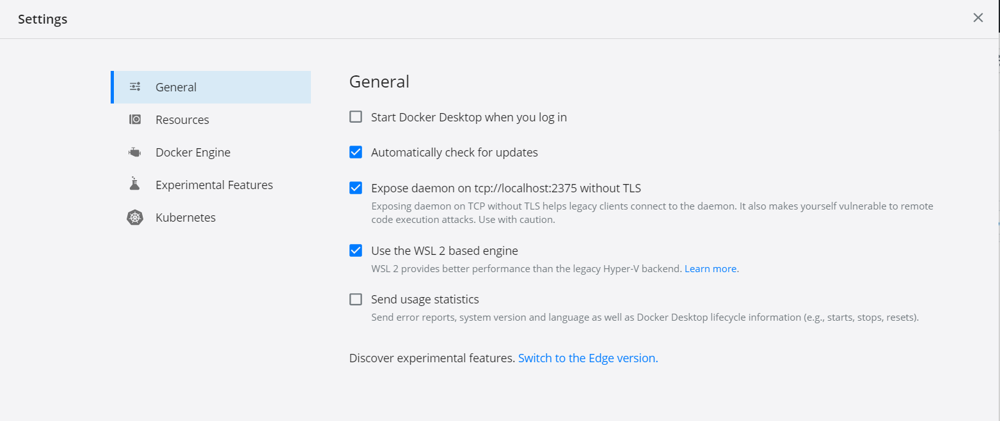
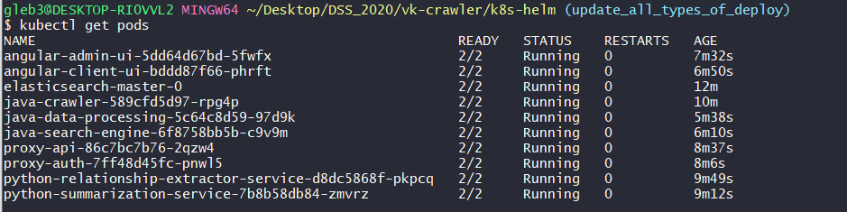
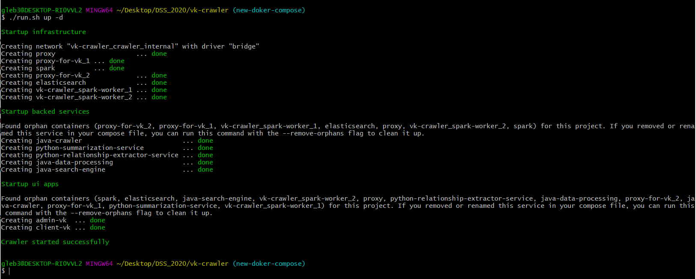
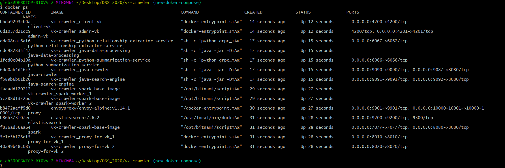
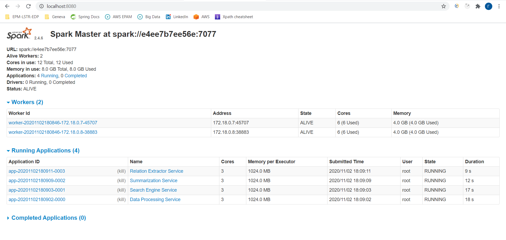

**Description:** <br><br>
Автоматический агрегатор данных с ВК (используя АПИ ВК) 
(тексты из пуб. Страниц пользователей, постов в группах заданных администратором) + прослойка с ElasticSearch + микросервисы с нейронками выдающими краткую суть  текстов, пары персонаж - отношение,+ Клиент поиска постов и визуализации графа взаимо отношений пользователей к людям (вася не любит петю и дашу но обажает машу)

**Demo:**<br>
[Crawler-App demo](https://www.youtube.com/watch?v=MXfpYYRk6eI) <br>
[Helm-Istio demo](https://www.youtube.com/watch?v=MwToFe6DJmg) <br>

❗  **Important:** deploy via helm tested ONLY on windows 10 with WSL2 with following settings now: <br> 



❗ **Note:** for fast start now [12/11/2020] better to use docker-compose

**For deploy in k8s:**<br>

❗  **Important:** deploy will be rewritten after istio issue fix: https://github.com/istio/istio/issues/27900  <br>

Requirements:<br>

* **Docker on WSL2** ( if locally )<br> 
* **Kind** ( choco install kind --version=0.9.0 (if locally) )<br>
* **Kubectl** ( choco install kubernetes-cli --version=1.19.1 )<br>
* **Helm** ( choco install kubernetes-helm --version=3.4.0 )<br>
* **Itioctl** ( choco install istioctl --version=1.7.4 )<br>

**To deploy ( it takes about 20-30 minutes ):**
1. open git bash (if you have Windows) or bash (if Unix)
2. cd k8s-helm
3. sh deploy.sh

<br>
Checkout k8s cluster with command 

```
kubectl get pods
```

untill you see something like:<br>



<br>

**How to use with deploy:** (url of ui apps different from local startup)
1.  go to [admin app](http://localhost:4200/admin)
2.  go to [client app](http://localhost:4200/client)

<br>

**To delete cluster:**
1. open git bash (if you have Windows) or bash (if Unix)
2. cd k8s-helm
3. sh delete.sh

<br>

**For local startup:**
1. open git bash (if you have Windows) or bash (if Unix)
2. ./run.sh build (build all images - it takes about 20+ minutes to build depending on the your hardware)<br>
    or <br>
    ./run.sh pull (pull latest images from my [docker hub](https://hub.docker.com/u/hronosf) - it takes about 5-10 minutes to download depending on your network conection) 
3. ./run.sh up -d

After "./run sh up -d" command you should see: <br>
<br><br>
Run **"docker ps"** - make sure that all containers are healthy:
<br><br>
Go to [Spark-Master UI](http://localhost:8080) and check that all services connected to cluster:<br>



**Tips:**
1. For better perfomance use local Spark-3.0.1 && Hadoop-2.7 ([Intallation guide](https://phoenixnap.com/kb/install-spark-on-windows-10))
2. Configure Spark standalone cluster setting via:
    * docker-compose-infra.yml (how much resources allocated for worker)
    * run.sh (how much workers to up)
    * docker-compose-services.yml (how much cores should each spark-service use from each worker, spark-master url)

**How to use locally:**
1. start up
2. go to [admin app](http://localhost:4201)
3. login to ["Vkontakte"](https://vk.com) if needed (app will automaticly redirect to vk OAuth2 page)
4. search for groups/user which walls you want to parse
5. checkout them (here crawler starts)
6. go to [client app](http://localhost:4200)
7. search with full text or by user/group id among parsed posts
8. enjoy it :)

<br>**Project infrastructure:**<br><br>

